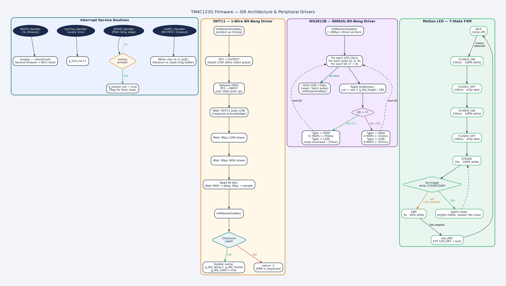
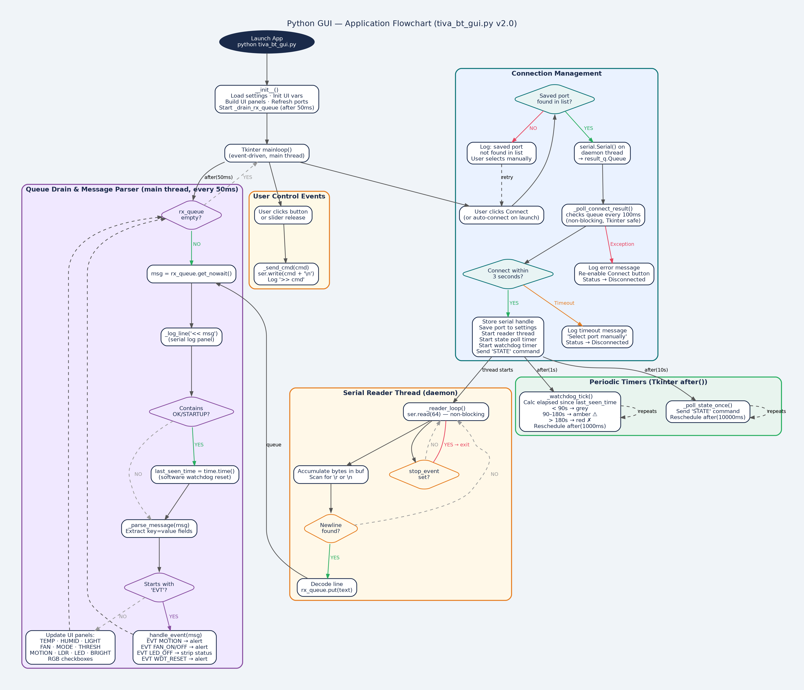
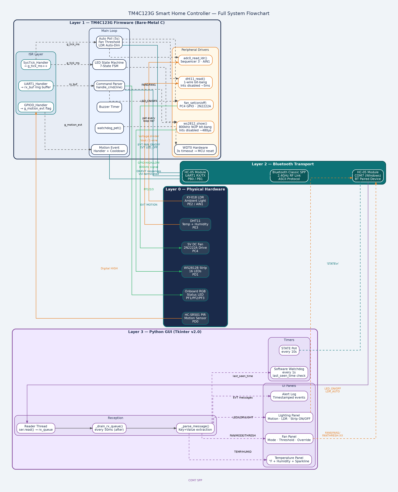

# TM4C123G Smart Home Controller

A bare-metal embedded IoT system built on the **Texas Instruments TM4C123G LaunchPad**. Sensor data is read directly from hardware peripherals, processed in firmware written entirely in C without any Arduino or RTOS libraries, and transmitted wirelessly over Bluetooth Classic (UART) to a Python desktop GUI and optionally an Android application.

The primary goal of this project is to demonstrate practical understanding of UART-based IoT communication, embedded peripheral integration, and cross-platform Bluetooth application development” all without relying on high-level abstraction layers.

---

## Features

- **Temperature & Humidity Monitoring** — DHT11 1-wire bit-bang driver, readings displayed live in GUI with a scrolling sparkline graph
- **Ambient Light Sensing** — KY-018 photoresistor via ADC; auto-dims WS2812B LED strip inversely with room brightness
- **Motion Detection** — HC-SR501 PIR sensor on a GPIO edge interrupt; triggers double-flash LED sequence and buzzer alert
- **Addressable LED Strip** — 16× WS2812B LEDs driven by a cycle-counted NOP bit-bang driver at 800 kHz; full on/off/brightness control
- **Auto-Threshold Fan Control** — 5V DC fan via 2N2222A transistor; spins automatically when temperature exceeds a user-configurable threshold with 2°F hysteresis
- **Hardware Watchdog Timer** — TM4C WDT0 with 3-second timeout; auto-resets the MCU if the main loop stalls; GUI receives `EVT WDT_RESET` on recovery
- **Software Watchdog** — GUI tracks last device response timestamp; displays amber/red warnings at 90s/3min of silence
- **Bluetooth Dual-Control** — every peripheral supports both automatic sensor-driven behavior and manual override via Bluetooth command
- **Python GUI** — Tkinter dashboard with live sensor panels, fan/LED/motion controls, temperature sparkline, alert log, and collapsible serial log
- **Structured ASCII Protocol** — human-readable command/response protocol with unsolicited `EVT` messages for asynchronous events

---

## Hardware

| Component | Part | Interface | TM4C Pin |
|---|---|---|---|
| Microcontroller | TM4C123GH6PM LaunchPad | — | — |
| Bluetooth Module | HC-05 SPP | UART1 (9600 8N1) | PB0 (RX), PB1 (TX) |
| Temp/Humidity Sensor | DHT11 | 1-wire bit-bang | PE3 |
| Ambient Light Sensor | KY-018 LDR module | ADC0 AIN1 | PE2 |
| PIR Motion Sensor | HC-SR501 | GPIO interrupt | PD0 |
| LED Strip | WS2812B × 16 | GPIO bit-bang | PD1 |
| DC Fan | 5V brushless, 2-wire | GPIO via 2N2222A | PC4 |
| Onboard RGB LED | TM4C built-in | GPIO | PF1/PF2/PF3 |

### Supporting Components

| Component | Value | Purpose |
|---|---|---|
| NPN Transistor | 2N2222A | Fan motor drive |
| Flyback Diode | 1N4007 | Fan inductive spike protection |
| Resistor | 1kΩ | Transistor base current limiting |
| Resistor | 10kΩ | DHT11 data line pull-up |
| Resistor | 330Ω | WS2812B data line series termination |

---

## Wiring

### Power Rails (breadboard)
```
LaunchPad 3.3V  →  Left + rail   (sensors: DHT11, KY-018)
LaunchPad VBUS  →  Right + rail  (5V: HC-05, fan, LED strip)
LaunchPad GND   →  Both - rails, bridged
```

### Peripheral Connections
```
DHT11:     VCC→3.3V  GND→GND  DATA→PE3  [10kΩ between DATA and 3.3V]
KY-018:    VIN→3.3V  GND→GND  SIG→PE2
HC-SR501:  VCC→5V    GND→GND  OUT→PD0
WS2812B:   5V→5V     GND→GND  DIN→[330Ω]→PD1
Fan (+):   5V rail
Fan (-):   2N2222A Collector
2N2222A:   Base→[1kΩ]→PC4   Emitter→GND
1N4007:    Cathode→Fan(+)   Anode→Fan(-)
HC-05:     VCC→5V    GND→GND  TX→PB0    RX→PB1
```

---

## Firmware

**Language:** C (bare-metal, no RTOS, no Arduino libraries)  
**IDE:** Code Composer Studio (CCS)  
**SDK:** TivaWare DriverLib  
**Optimization:** `-O2` (required for WS2812B bit-bang timing)  
**Version:** 0.5
```

## System Flowcharts

### Firmware - Initialization & Main Loop


### GUI Application Flow


### Full System Architecture


---

### Architecture

```
main()
├── Peripheral Init (GPIO, ADC, UART1, SysTick, WDT0)
├── HC-05 Boot Delay (~2s, blue LED indicator)
├── Watchdog Arm
└── Main Loop
    ├── watchdog_pet()
    ├── Motion event handler  →  LED state machine
    ├── LED state machine     (IDLE→FLASH×2→STEADY→DIM→OFF)
    ├── Buzzer timer
    ├── Periodic auto-logic   (fan threshold, LDR dim) every 5s
    └── UART command handler  →  handle_cmd()
```

### Key Design Decisions

- **Interrupts off during DHT11 reads** — the 1-wire protocol requires microsecond-accurate timing; SysTick is masked for the ~5ms read duration
- **Interrupts off during WS2812B frame writes** — 800 kHz bit-bang at 16 MHz leaves ~20 cycles per bit; timing-critical section (~480µs for 16 LEDs)
- **NOP-based WS2812B timing** — `SysCtlDelay` call overhead (~8 cycles) is too large for the short T0H pulse; inline `__asm(" NOP")` provides single-cycle precision
- **Cached DHT11 readings** — 2-second re-read guard prevents protocol violations; all STATE queries serve cached data
- **Motion LED state machine** — 7-state FSM handles first-trigger flash sequence, steady-on, dim warning, and auto-off; re-trigger silently resets timer without re-flashing

---

## Command Protocol

All communication is ASCII over Bluetooth UART. Commands are `\n`-terminated. Responses are `\r\n`-terminated.

### Host → Device

| Command | Description |
|---|---|
| `PING` | Heartbeat check |
| `STATE` | Full system state snapshot |
| `TEMP` | Current temperature (°F) |
| `HUMID` | Current humidity (%) |
| `LIGHT` | Ambient light level (0–100%) |
| `FAN0` | Manual fan off |
| `FAN1` | Manual fan on |
| `FAN_AUTO` | Return fan to auto-threshold mode |
| `FANTHRESH:XX` | Set fan trigger temperature in °F (60–100) |
| `MOTION_ARM` | Arm PIR sensor |
| `MOTION_DISARM` | Disarm PIR sensor |
| `LED_ON` | Turn LED strip on (white, current brightness) |
| `LED_OFF` | Turn LED strip off |
| `LED_BRIGHT:XX` | Set LED brightness 0–100 |
| `LDR_AUTO` | Return LED to ambient-light auto-dim |
| `LDR_MAN:XX` | Manual brightness override 0–100 |
| `BUZZ:X` | Buzz for X×100ms |
| `BUZZ0` | Stop buzzer |
| `RGB:xyz` | Set onboard RGB LED (e.g. `RGB:100`) |
| `R0/R1 G0/G1 B0/B1` | Set individual RGB channels |
| `X` | All onboard LEDs off |
| `VERSION` | Firmware version |
| `UPTIME` | Seconds since last boot |
| `HELP` | List all commands |
| `EXIT` | Close session |

### Device → Host

| Message | Trigger |
|---|---|
| `OK PONG` | Response to `PING` |
| `OK TEMP=72F` | Response to `TEMP` |
| `OK HUMID=45%` | Response to `HUMID` |
| `OK LIGHT=63` | Response to `LIGHT` |
| `OK RGB=xyz TEMP=72F HUMID=45% FAN=0 MODE=AUTO THRESH=80 MOTION=ARMED LIGHT=63 LDR=AUTO LED=0 BRIGHT=100` | Response to `STATE` |
| `EVT MOTION` | Unsolicited — PIR triggered |
| `EVT FAN_ON TEMP=81F` | Unsolicited — fan auto-activated |
| `EVT FAN_OFF` | Unsolicited — fan auto-deactivated |
| `EVT LED_OFF` | Unsolicited — motion auto-off timer expired |
| `EVT WDT_RESET` | First message after watchdog reset |
| `STARTUP TEMP=69F HUMID=29% LIGHT=52` | Sent once on boot after HC-05 settles |

---

## GUI Application

**Language:** Python 3  
**Framework:** Tkinter  
**Dependency:** `pip install pyserial`

### Running

```bash
python tiva_bt_gui.py
```

Pair HC-05 in Windows Bluetooth settings (PIN: `1234`). Select the assigned COM port from the dropdown and click Connect.

### Layout

```
┌─────────────────────────────────────────────────────�
│  COM Port  [dropdown]   Baud [dropdown]  [Connect]  │
│  � Connected                  Last seen: 2s ago     │
├──────────────┬──────────────┬───────────────────────┤
│ TEMPERATURE  │     FAN      │       LIGHTING        │
│  72.4 °F     │ Mode: AUTO   │ Motion: ARMED         │
│  Humidity:   │ Thresh: 80°F │ LDR: AUTO             │
│  [sparkline] │ [slider]     │ Brightness [slider]   │
│  [Read Now]  │ FAN ON/OFF   │ STRIP ON / STRIP OFF  │
├──────────────┴──────────────┴───────────────────────┤
│ RGB Controls         │  Utilities                   │
├──────────────────────┴──────────────────────────────┤
│ ALERTS                                              │
├─────────────────────────────────────────────────────┤
│ Serial Log (raw)                         [▼ Hide]   │
└─────────────────────────────────────────────────────┘
```

### Key Features

- **10-second STATE polling** — all panels update automatically
- **Temperature sparkline** — scrolling line graph of last 15 readings
- **Software watchdog** — "Last seen" counter; amber at 90s, red at 3min
- **Alert log** — timestamped events (motion, fan, LED auto-off, WDT reset)
- **Fan panel** — AUTO/MANUAL mode toggle, threshold slider, manual ON/OFF
- **LED strip panel** — auto-dim toggle, manual brightness slider, STRIP ON/OFF
- **Non-blocking connect** — 3-second timeout watchdog prevents GUI freeze on bad COM port

---

## Motion-Triggered LED Behavior

On first motion detection (strip was off):
1. Strip flashes ON 150ms, OFF 150ms (×2) — visual acknowledgment
2. Holds steady white at 100% for 25 seconds
3. Dims to 40% for final 5 seconds — "turning off soon" warning
4. Strip off; `EVT LED_OFF` sent to GUI

On re-trigger while strip is on: timer silently resets to 30 seconds, brightness restores to 100%. No flash — prevents annoying strobe effect when someone is actively in the room.

---

## Project Structure

```
/
├── main.c                    # TM4C123G firmware (v0.5)
├── tiva_bt_gui.py            # Python desktop GUI (v2.0)
├── tm4c123gh6pm_startup_ccs.c
├── tm4c123gh6pm.cmd
├── targetConfigs/
│   └── Tiva TM4C123GH6PM.ccxml
└── README.md
```

---

## Known Limitations

- **DHT11 precision** — ±2°C accuracy, integer-only output (no decimal degrees). Suitable for indoor ambient monitoring; not for precision applications.
- **WS2812B color control** — driver is optimized for white-only output at variable brightness. Full RGB color control exists in firmware but timing at 16 MHz limits reliable color fidelity.
- **Single Bluetooth client** — HC-05 SPP supports one paired device at a time. Switching between Python GUI and Android app requires re-pairing.
- **No persistent configuration** — firmware state (thresholds, mode settings) resets to defaults on every power cycle.

---

## Future Work

- [ ] Android app (Kotlin / Jetpack Compose) — bidirectional Bluetooth Classic
- [ ] PWM fan speed control (replacing on/off with proportional control)
- [ ] WS2812B full color command support with improved timing
- [ ] EEPROM persistence for threshold and mode settings
- [ ] Multiple sensor nodes via ESP32 mesh

---

## License

MIT License. See `LICENSE` for details.

---

*Built at Lawrence Technological University — Embedded Software Engineering*
